<!-- BANNER - terminal profile.sh --live (additive). Generated by scripts/banner/generate.py.
     ~0.7–0.8 MB each. Cache-bust with ?v=N after regenerating. -->
<picture>
  <source media="(prefers-color-scheme: dark)"  srcset="assets/banner-dark.v9.svg">
  <source media="(prefers-color-scheme: light)" srcset="assets/banner-light.v9.svg">
  
</picture>

 

<!-- NAME / TAGLINE - animated typing -->

 

<!-- SOCIALS — LinkedIn stays brand blue (glyph vanishes on custom fills). Others themed. -->
&nbsp;&nbsp;
&nbsp;&nbsp;

 

---

<h1 align="center"><b>Hi , I'm Euler Gomez </b></h1>
<!--  -->

🎓 Agricultural professional with a strong focus on:
- 🌱 Sustainable production systems
- 📊 Data analysis
- 📈 Statistical modeling
- 🧬 Agricultural biotechnology

&nbsp;***About me***

I am passionate about applying quantitative and technological tools to agriculture, particularly in:
- Aboveground biomass estimation
- Carbon stock and sequestration analysis
- Allometric modeling
- Sustainable agricultural systems
- Gene editing in agriculture (CRISPR/Cas9)

My goal is to bridge agricultural science and data-driven decision-making.

## My Skills Include

<h4> Languages </h4>
 
  
  
  
  
  
  
  
  

<h4> Other Tools and Technologies </h4>

  
  
  
  
  

## 📚 Currently Working On

- Biomass estimation in Amazonian palm species
- Statistical modeling applied to agricultural systems
- Academic CV development using RenderCV
- Scientific article preparation (journal format)

## 📊 GitHub Stats

---

⭐ Always open to collaboration in agricultural research, sustainability, and data-driven projects.
